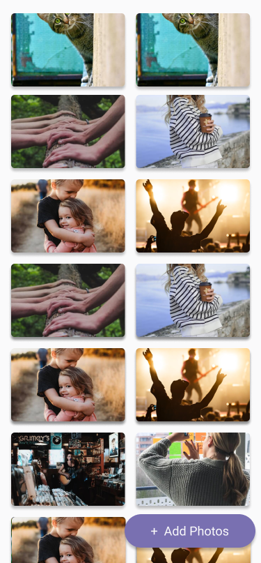

## Clue Android Assignment
The purpose of this assignment is to evaluate your technical skills, coding practices, and how you apply them in an Android project. The most critical aspect is that your solution compiles, runs, and meets all the functional requirements outlined below. Beyond that, we want to see how you structure your code, showcase your versatility, and demonstrate your ability to write clean, maintainable software.

### Task
The assignment is to develop an image fetching application using the UnSplash API. This application should enable the users to add a random image to a list, that is persisted across sessions.

#### Submission
Once you arrive to a solution that you're comfortable with, please submit a pull request.

#### API documentation
The UnSplash API requires a key. It can be obtained through this [url](https://unsplash.com/documentation#creating-a-developer-account) by creating a developer account.

The full documentation of the API can be found [here](https://unsplash.com/documentation).
The random image endpoint documentation can also be found [here](https://unsplash.com/documentation#get-a-random-photo)

#### Requirements

- On first start, the user sees a single image in a list coming from the API.
- When the user clicks a button, a new random image from the API is appended to the list.
- When the user taps on an image, the image details (description, location, number of likes etc.) are displayed (It's up to you to decide how, where and how many of these details you want to show).
- When the app is reopened, the list from the previous session is displayed.

#### Sample Screen
Feel free to come up with the best UI that fulfills the requirements, you can use the image below as inspiration.

#### Expectations
The most critical **baseline expectation** is that the app written in Kotlin, compiles, runs, and meets the all functional requirements. 

Beyond that, we want to evaluate your approach to developing a robust and maintainable application.
How you choose to showcase your abilities is up to you. Consider the following aspects that usually rank higher in our review, but it’s not required to implement everything:

- **Architecture & Code Structure:** **MVVM (Model-View-ViewModel)** and multi-module architecture is preferred. However, **clean separation of concerns** is more important. 
- **Use of Modern Android Practices:** Usage of **Jetpack Compose**, **Hilt**, **StateFlow** is nice to be showcased.
- **Testing Coverage:** Adding a few **unit or UI tests** could highlight how you approach testing.
- **Error Handling:** Demonstrating how you handle variety of **possible failures** would be important.
- **Security:** Considering major security issues will lead to positive remarks. 
- **Documentation:** A **well-written README** explaining architecture decisions and trade-offs will be consistently praised.
- **Scalability & Maintainability Considerations:** A balance between **clean code and simplicity** is appreciated over unnecessary complexity.

This assignment serves as a foundation for the follow-up in-depth interview. Use this opportunity to highlight your strengths, whether through architectural decisions, performance optimizations, innovative solutions, or additional features that enhance the user experience.

This repository is providing a base implementation, but don’t feel obligated to follow it, if it doesn’t align with your solution. Feel free to use any library or pattern you think is suitable for the project.

Feel free to send us emails if you have any question.

We look forward to seeing what you come up with, have fun!
